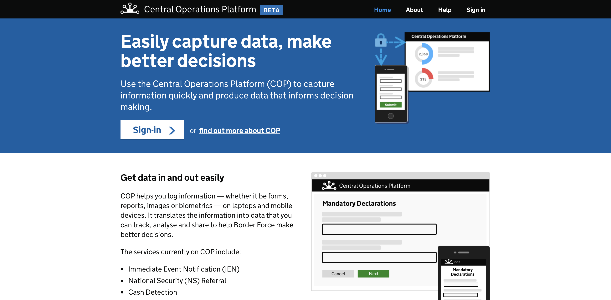

# Central Operations Platform (COP) product page

This repository contains a number of [components](#components) that renders GDS web elements.
They can be used to build/ maintain/ improve the COP product page which in result will render GOV.UK themed pages. Similar to [GOV.UK Pay], [GOV.UK
Notify] and [GOV.UK Registers].



This site is built in [Gatsby.js] under the react framework which uses 'Hooks' to render each component that allows developers to inject components in to 'mdx' files.
MDX files are used for content. Developers may alter content by changing text, inline styling, adding and removing components imported in to the mdx files.

A minimum of Javascript/ React knowledge is required to develop and maintain this site for creating new components.
Changing content within the MDX content files only requires knowledge to import, remove components from mdx files and to have an understanding of 'props' and how some components may need text, images, list of any other types of content data injecting in to a component as a 'prop.' This allows each component to be reused in many areas of the site.

Information of React and JSX can be found [here.](https://reactjs.org/docs/introducing-jsx.html)

## What are mdx files?

MDX files is a superset of Markdown files (.md) that allows developers to use jsx and html. This is an enhancement of markdown files which adds styling, logic and jsx written components in to the same file. In result, making it maintainable, reusable and reduces the limitation of a basic markdown file.
More information about mdx files can be found [here.](https://mdxjs.com/getting-started)

As an example, in this repository, you will be able to see an imported 'Paragraph' depending on what you are trying to achieve. 
e.g. Reusing the the GDS paragraph component and adding in text as a prop  `<Paragraph text={'Hello world'}/>` 

Or, adding in different inline custom styling and hyperlinks within a paragraph. `<p class="body-text">click <a class="link" href="[link]">here</a></p>`

## Styling
Styling has been imported from the GDS frontend tool kit which leads to the [AlphaGov] repository. In this repository, images, css was imported from the 'dist' files.
New styling classes added in for specific layout purposes but does affect the styling of GDS components.

CSS Styling classes can be found in [layout.css.](src/components/layout.css)

## Components

Link to each component to get an idea of how they are written in JSX

- [Break-line](src/components/Break-line.js)
- [Bullet-list](src/components/bullet-list.js)
- [Button](src/components/button.js)
- [Extra-large-title](src/components/extra-large-title.js)
- [Footer](src/components/footer.js)
- [Head](src/components/head.js)
- [Header](src/components/header.js)
- [Hr](src/components/hr.js)
- [Hyperlink](src/components/hyperlink.js)
- [Image](src/components/image.js)
- [Large-paragraph](src/components/large-paragraph.js)
- [Large-title](src/components/large-title.js)
- [Logo](src/components/logo.js)
- [Medium-Title](src/components/MediumTitle.js)
- [Panel](src/components/panel.js)
- [Paragraph](src/components/paragraph.js)
- [Phase-banner](src/components/phase-banner.js)
- [Stats-content](src/components/stats-content.js)
- [Sub-Panel](src/components/sub-panel.js)
- [Sub-navigation](src/components/sub_navigation.js)
- [Video](src/components/video.js)

Please feel free to create new components if needed in the future.

## Layout

[Layout](src/components/layout.js) component displays the top herachy structure of the gastby static app.
Below you will see a [Head](src/components/head.js) component which includes the traditional head metadata, favicon and style and script links.

[Header](src/components/header.js) component displays the banner with navigational links.

'{children}' is the mdx page output which displays above the [footer](src/components/footer.js) component.

```javascript
    const Layout = ({ children }) => (
      <>
        <Head/>
        <Header/>
        {children}
        <Footer/>
      </>
    );
```

## Running Example Locally

If you wish to run the example in your own browser, you'll need to run the
following commands from the root of this project: 

Note: [NPM] must be installed

- `npm install -g gatsby-cli` to install Gatsby command line interface
- `npm install` to install react, gatsby and Matomo and the frontend dependencies
- `gatsby develop` - to start the development server (localhost:8000)
- `gatsby build` - to build the static site
- `gatsby serve` - to start the server and view the static site (localhost:9000)

## Frontend Dependencies

[Gatsby.js], [React], [Matomo] and [Matomo Gatsby Plugin] are included using [NPM] and bundled in
on build. You can include more [NPM] modules easily by installing them as a
dependency and including paths to them. 

Running `npm install` will install these packages as they are stated within the package.json.

[GOV.UK Frontend] asset files has been imported manually.

### Matomo plugin
Matomo plugin is used in this site. By looking at the [gatsby-config.js](gatsby-config.js) file you will be able to change the config data within the matomo plugin.

```javascript
    {
      resolve: 'gatsby-plugin-matomo',
      options: {
        siteId: '[SITEID]',
        matomoUrl: '[MATOMO URL',
        siteUrl: '[SITE URL]'
      }
    }
```

Any changes made in this file would require you to run `gatsby develop` or `gatsby build & gatsby serve`

### Testing
[Jest] -  used for unit testing
Run `npm test` to run the unit tests. All component spec files are in the `__test__` folder within the `component folder.`
This can be found [here.](src/components/__tests__)

To run the test, simply run `npm test` command.
To run the test after changing html code, run `npm install -- -u` to update the snapshots.

[Nightwatch] - used for end to end testing. Page objects, variables and test specs can be found in the `Nightwatch` folder within the `root.`
This can be found [here.](nightwatch)

[GOV.UK Pay]: https://www.payments.service.gov.uk/
[GOV.UK Notify]: https://www.notifications.service.gov.uk/
[GOV.UK Registers]: https://registers.cloudapps.digital/
[GOV.UK Frontend]: https://github.com/alphagov/govuk-frontend/tree/master/dist
[NPM]: https://npmjs.com
[Jest]: https://jestjs.io/docs/en/getting-started
[Nightwatch]: https://nightwatchjs.org/gettingstarted
[AlphaGov]: https://github.com/alphagov/govuk-frontend/
[Gatsby.js]: https://www.gatsbyjs.org/docs/
[React]: https://reactjs.org/docs/getting-started.html
[Matomo]: https://developer.matomo.org/
[Matomo Gatsby Plugin]: https://www.gatsbyjs.org/packages/gatsby-source-matomo/